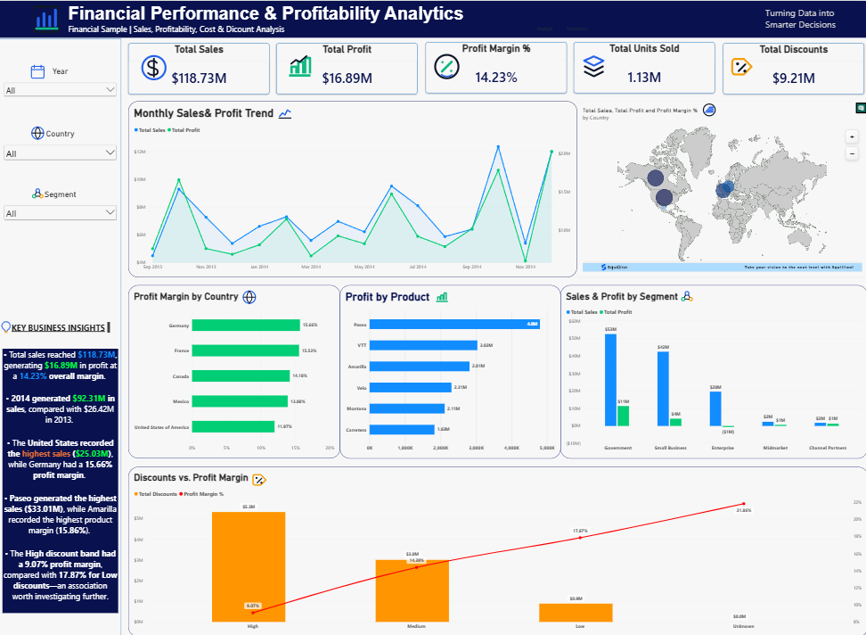

# Financial Performance & Profitability Analytics

An end-to-end financial analytics project using Python, Power BI, and DAX to analyze sales performance, profitability, costs, discounts, products, countries, and business segments.

## 📌 Project Overview

This project transforms financial transaction data into actionable business insights through data cleaning, exploratory analysis, KPI development, profitability analysis, and interactive Power BI visualization.

## 🎯 Business Objectives

- Analyze overall sales and profitability
- Evaluate profit margins across markets and products
- Identify high- and low-performing business segments
- Analyze discount patterns and their association with profitability
- Compare financial performance across countries
- Identify monthly sales and profit trends
- Build an executive-level Power BI dashboard

## 🛠️ Tools & Technologies

- Python
- Pandas
- NumPy
- Matplotlib
- Seaborn
- Jupyter Notebook
- Power BI
- DAX
- GitHub

## 📊 Dataset

The project uses Microsoft's Financial Sample dataset containing **700 records and 16 original fields**, covering financial performance across countries, products, segments, and monthly periods.

**Period:** September 2013 – December 2014

## 💰 Key KPIs

| KPI | Value |
|---|---:|
| Total Sales | $118.73M |
| Total Profit | $16.89M |
| Total COGS | $101.83M |
| Total Units Sold | 1.13M |
| Overall Profit Margin | 14.23% |

## 🔍 Key Analysis

### Yearly Performance

2014 generated $92.31M in sales and $13.01M in profit, compared with $26.42M in sales and $3.88M in profit in 2013.

### Geographic Performance

The United States generated the highest sales at approximately $25.03M, while Germany recorded a 15.66% profit margin.

### Product Performance

Paseo generated the highest sales at approximately $33.01M, while Amarilla recorded the highest product profit margin at 15.86%.

### Segment Performance

Profitability varied considerably across business segments, with Enterprise recording a negative profit in this dataset.

### Discount Analysis

The dataset shows an association between higher discount rates and lower profit margins:

- Low discount: 2.49% discount rate → 17.87% profit margin
- Medium discount: 7.19% → 14.39%
- High discount: 12.46% → 9.07%

This represents an observed association in the dataset and does not establish causation.

## 📊 Power BI Dashboard

The interactive dashboard includes:

- Financial KPI cards
- Monthly Sales & Profit Trend
- Global Sales Performance Map
- Profit Margin by Country
- Profit by Product
- Sales & Profit by Segment
- Discounts vs. Profit Margin
- Year, Country, and Segment filters
- Key Business Insights



## 📁 Project Structure

```text
Financial_Performance_Profitability_Analytics/
│
├── Data/
├── Models/
├── Notebooks/
├── PowerBI/
├── Screenshots/
│   └── Dashboard.png
└── README.md

👨‍💻 Author
Mohammad Farhan
MBA – Business Analytics & Artificial Intelligence
Middlesex University Dubai
Skills: Python | SQL | Power BI | Excel | DAX | Data Analytics | Business Intelligence | Predictive Analytics


